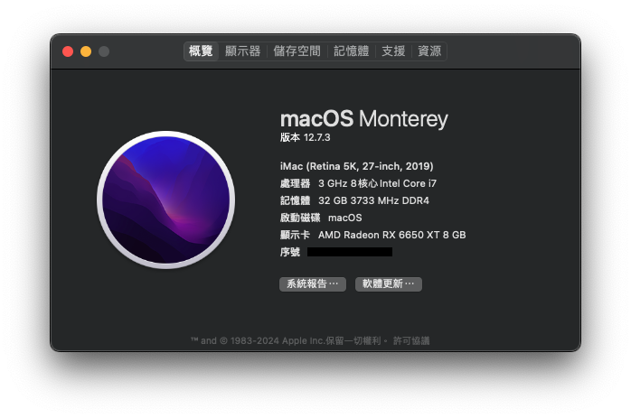
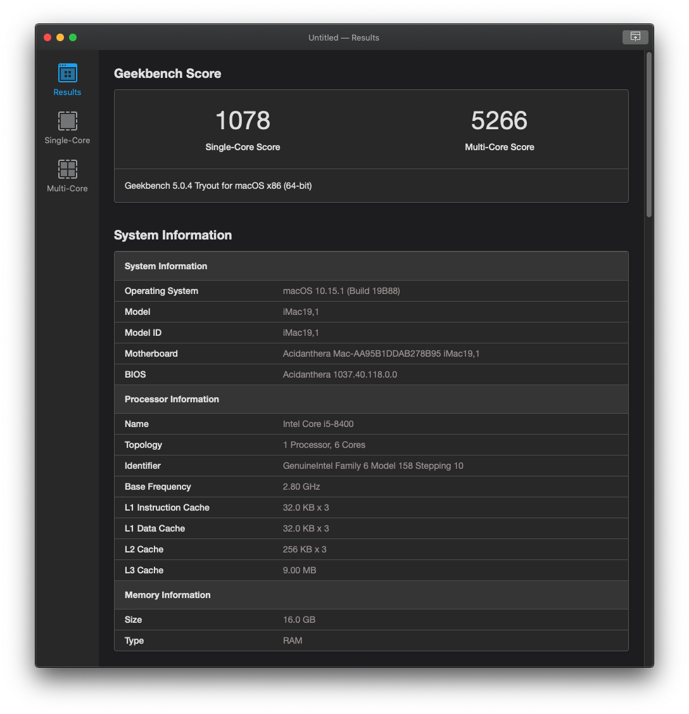
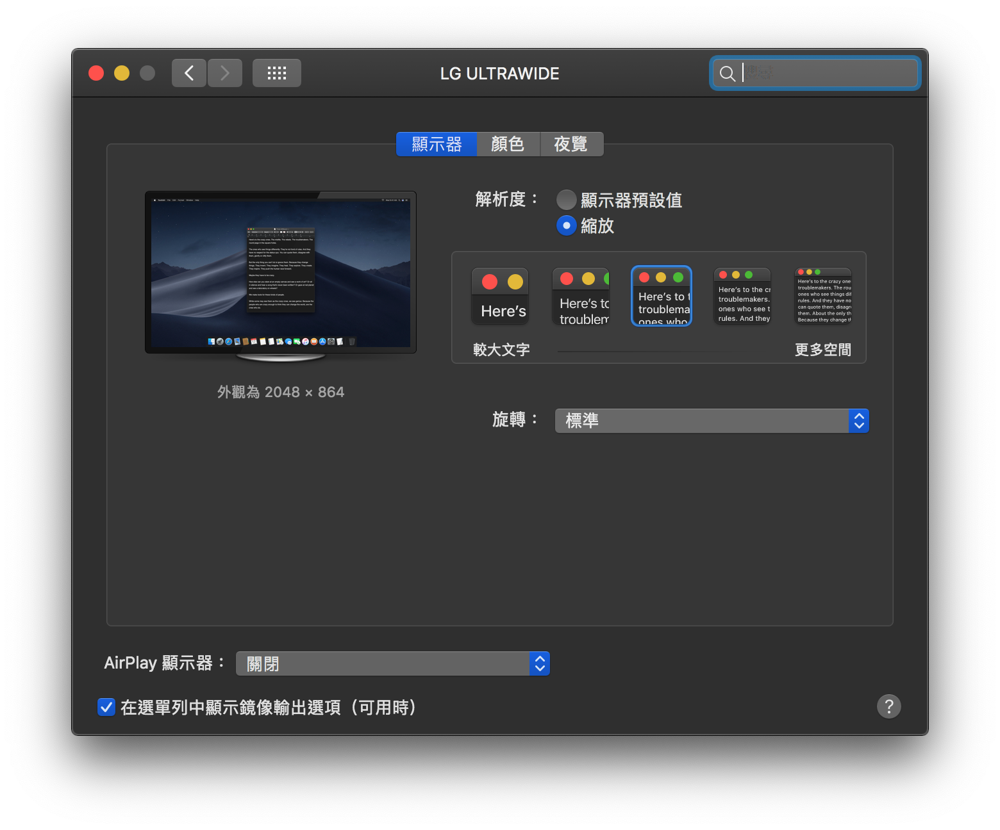

# Hackintosh — i7-9700 · ASUS TUF Z370 · RX 6650 XT

> OpenCore EFI and configuration for running macOS Monterey on a Coffee Lake desktop build.

---

## Hardware

| Component | Model |
|---|---|
| CPU | Intel Core i7-9700 (8C · 3.0 GHz · 3.8 GHz Boost) |
| Motherboard | ASUS TUF Z370-PLUS GAMING |
| GPU | Fighter AMD Radeon RX 6650 XT 8 GB GDDR6 |
| RAM | Kingston HyperX Predator RGB DDR4 3200 MHz 16 GB × 2 (OC @ 3766 MHz) |
| Storage | 500 GB NV1 M.2 2280 NVMe SSD |
| PSU | Corsair TX550M 80 PLUS Gold |
| Display | LG 34UM58-P 34″ 21:9 UltraWide WQHD IPS |
| Keyboard | Logitech G610 Orion Blue |
| Mouse | Logitech G502 HERO |

---

## What works / what doesn't

| Feature | Status | Notes |
|---|---|---|
| Graphics (RX 6650 XT) | ✅ | H.264 & HEVC hardware encode/decode |
| Sleep / Wake | ✅ | |
| USB 3.1 | ✅ | |
| Ethernet | ✅ | |
| Wi-Fi | ✅ | |
| Bluetooth / Handoff | ✅ | |
| Audio | ✅ | |
| CPU frequency scaling | ✅ | |
| HiDPI | ✅ | See screenshot below |
| iGPU (UHD 630) | ❌ | Disabled — dedicated GPU only |

---

## BIOS settings

Key settings:

- CFG Lock → **Disabled**
- CSM → **Disabled**
- EHCI / XHCI Hand-off → **Enabled**
- Above 4G Decoding → **Enabled**
- VT-d → **Disabled**

---

## Installation

Follow the [OpenCore Vanilla Desktop Guide](https://dortania.github.io/OpenCore-Install-Guide/) — specifically the **Coffee Lake** section. This config targets a desktop dGPU-only setup (no iGPU output), so:

1. Download the latest release EFI from the [Releases](../../releases) page.
2. Mount your EFI partition and replace the existing EFI folder.
3. Apply the BIOS settings above.
4. Boot from the USB installer and install macOS normally.

> ⚠️ **Generate your own SMBIOS serials** before first boot. Never share MLB / ROM / Serial values publicly. The checked-in `OC/Config.plist` intentionally leaves these values blank.

---

## Disclaimer

This repository is a personal compatibility reference for one hardware build. It is not a universal EFI, and it does not include Apple software or any private serial identifiers. Review the OpenCore documentation, generate your own SMBIOS values, and back up your current EFI before using any file from this repository.

---

## Benchmarks

- CPU: https://browser.geekbench.com/v6/cpu/5200659
- GPU compute: https://browser.geekbench.com/v6/compute/1868101

---

## HiDPI

---

## Releases

| Tag | OpenCore | macOS |
|---|---|---|
| [v1.0.3](../../releases/tag/v1.0.3) | 0.9.8 | Monterey 12.7.3 (21H1015) |
| [v1.0.2](../../releases/tag/v1.0.2) | 0.8.4 | Monterey 12.6 (21G115) |
| [v1.0.1](../../releases/tag/v1.0.1) | 0.8.1 | Monterey |
| [v1.0](../../releases/tag/v1.0) | 0.5.3 | Pre-release |

---

## License

MIT — feel free to use this config as a reference. If it helps you, a ⭐ is appreciated.
